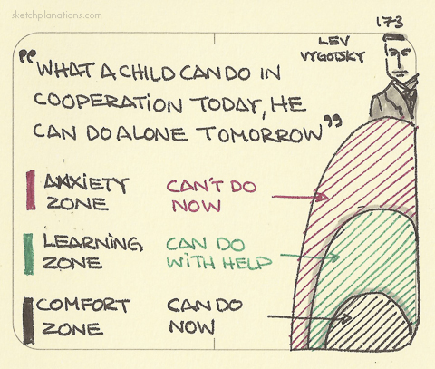
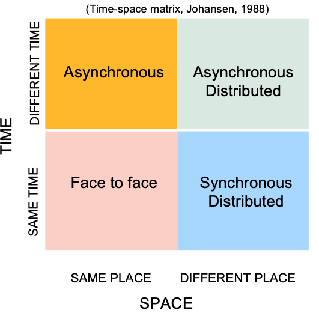

# Learning Theories and Technologies {#learningtheories}
## How do people learn?
Theories of learning (or, learning theories) aim to describe how people **learn**. According to [@gross2012psychology], learning can be described as the process of acquiring new understanding, knowledge, behaviors, skills, values, attitudes, and preferences. Once we have established a basic understanding of how people learn, then we can move forward to explain why certain interventions work better than others and to develop strategies for enhancing learning. That is, support people to learn **more**, **faster**, or **easier**.

For the purpose of this lecture, we will go briefly over four major learning theories: a) behaviourism, b) cognitivism, c) constructivism, and d) social constructivism.

### Behaviourism{#behaviorism}
Behaviourists (for example, [Ivan Pavlov](https://en.wikipedia.org/wiki/Ivan_Pavlov) and [B. F. Skinner](https://en.wikipedia.org/wiki/B._F._Skinner)) argued that the brain is a **black box**: one cannot document or study what's going inside the brain, but we can only gain insights about the brain's processes by observing the **subject's** behaviour. According to behaviourists, behaviour is the result of stimulus–response and, as such, behaviourism is primarily concerned with observable behavior. Here, we use the word **subject** because behaviourists did not limit their work in studing humans, but also animals.

For example, Pavlov is famous for his experiments on dogs to establish [classical conditioning](https://en.wikipedia.org/wiki/Classical_conditioning#:~:text=Pavlov%20called%20the%20dogs'%20anticipatory,in%20response%20to%20the%20stimulus.): Every time he was feeding the dog, he would ring a bell and the dog salivated at the sight of food. After some time, Pavlov removed the reward (food) from the experiment and he was only ringing the bell. What he saw was that the dogs would start salivating when he rang the bell even when food was not present. In Pavlov's experiment of classical conditioning, or learning through association, two stimuli (ringing the bell and giving food) are linked together to produce a new learned response in a subject (salivating). 

Taking it a step further, B. F. Skinner studied how behaviour is influened by its consequences ([operant conditioning](https://en.wikipedia.org/wiki/Operant_conditioning)). The rough idea behind operant conditioning is that behavior that is rewarded (either via positive or negative reinforcement) will most likely be repeated. On the contrary, behavior that is punished will occur less.
By positive reinforcement, we mean strengthening a behaviour by providing rewards. For example, when we reward a child who has finished their homework by giving them cookies.
By negative reinforcement, we mean strengthening a behaviour by terminating an unpleasant state. For example, when we reward a child who has finished their homework by taking away the task of washing the dishes.
By punishment, we practically mean the opposite of reinforcement. Punishment indeed aims to weaken or eliminate a behaviour. For example, when we punish a child who has NOT finished their homework by not allowing them to go out and play with friends.

### Constructivism
Constructivism proposes that people learn by constructing knowledge and making sense as they interact with their environment. Learning, according to constructivism, occurs when knowledge is constructed by the individual as a result of their experiences in the world. The core concept of constructivism is that knowledge is constructed as learners build new knowledge on the basis of what they have already learned. This definition consequently means that a) learning should be active; b) teaching can be defined as creating opportunities for learning.

[Jean Piaget](https://en.wikipedia.org/wiki/Jean_Piaget), a Swiss psychologists and prominent figure of constructivism, described how people construct knowledge from their interaction with the environment using the concepts of assimilation, and accommodation. 

Briefly, assimilation refers to the ability of humans to adjust new experiences so that they fit prior known concepts. For example, a very young child who has experience with dogs but not with other, larger animals, may mistakenly classify a horse as a dog. This is because the child tries to fit the new concept (horse) into the concept prior known (dog). Accommodation on the other hand, refers to adjusting prior known concepts to fit new experiences. For example, a child has formed the concept of 4-legged animals to describe dogs and cats. Then one day, the child sees for the first time a sheep and adjusts the concept 4-legged animals to include sheep. 

Piaget also proposed that the cognitive development of humans involves 4 stages (Figure \@ref(fig:piagetstages)) :

*   Sensorimotor (birth - 2 years): experiencing the world through senses and actions
*   Pre-operational (2 years - 6 years): representing things with words and images but lacking logical reasoning
*   Concrete operational (7 years - 11years): thinking logical about concrete event
*   Formal operational (12 years - onwards): abstract, hypothetical thinking, systematic deductive reasoning, interest in issues

The stages cannot switch, and they always take place int the same, set order. No phase can be skipped. Each Stage is based on the previous one, an expansion of the previous one.

```{r piagetstages, out.width = "13cm", fig.cap="Piaget's four stages of cognitive development", echo=FALSE, message=FALSE, warning=FALSE}

```


### Social Constructivism
Social constructivism builds on the premise of constructivism but advocates that learning is dependent on socio-cultural influences. Therefore, it is through interaction and exercise of communication that people learn. In other words, as opposed to constructivism that focuses on the individual learner, social constructivism explores the role of the social context in which learning takes place and argues that interaction between learners influences learning outcomes.
Consequently, social constructivism posits that we don't only learn through interaction with constructs but also from interacting with other humans within a social context. Consequently:
-   Culture plays a big part in learning
-   Cognitive functions are products of social interaction
-   Knowledge is co-constructed.
-   Learning is collaborative in nature and the role of the teacher and the peers is critical
-   Teachers should encourage collaboration and team work, should promote discussions and provide opportunities for group work.

[Lev Vygotsky](https://en.wikipedia.org/wiki/Lev_Vygotsky), a Russian psychologists famous for his contribution in social constructivism, portrayed how learning with others happens in his work on the Zone of Proximal Development (ZPD) [@cole1978mind]. The ZPD represents the cognitive state in which a learner can achieve a learning task when they receive appropriate support or help from a "*more knowledgeable other*" (Figure \@ref(fig:zpd)). This implies the following:

-   in order for help to be beneficial, the learner should be in the right cognitive state;
-   the learner may be in a state that they do not require the help of a knowledgeable other in order to learn. They can simply achieve the learning task on their own;
-   the learner may be in a state that they cannot achieve the learning task no matter how much help they receive;

```{r zpd, out.width = "13cm", fig.cap="A graphic interpretation of the Zone of Proximal Development", echo=FALSE, message=FALSE, warning=FALSE}

```

### Cognitivism
Contrary to the behaviourists, cognitivists argued that observable behaviors (see \@ref(behaviorism)) are not sufficient to describe learning because the internal thought processes are also part of learning. On top of that, cognitivists posit that one can tell what happens in the human brain! 
observable behaviors are not sufficient to describe learning because the internal thought processes are also part of learning.

In short, cognitivism is a learning theory that focuses on how information is received, organized, stored and retrieved by the mind. It uses the mind as an information processor. Or else, the human brain can be represented as a computer. Learners are actively involved in the way they process information. If we wants to improve and promote learning, then we should focus on developing knowledge, memory, thinking, and problem solving skills. Knowledge is viewed as symbolic mental constructs, or **schemata** (or else, representations). When learners' schemata change, learning takes place.

One of the most prominent representations of the human brain as a computer is portrayed in the Multi-store Model [@atkinson1968human] (see Figure \@ref(fig:multistoremodel)). According to this model, human memory consists of three separate memory stores connected a linear sequence: the sensory memory, the short-term memory and the long-term memory. Learning happens as information is transferred between these stores, from the human sensors (for example, eyes and ears) until it is successfully stored in the long term memory. 

```{r multistoremodel, out.width = "13cm", fig.cap="A simplified representation of human memory according to the Multi-store Model", echo=FALSE, message=FALSE, warning=FALSE}

```
Regarding the capacity of human memory, Sweller [@sweller1994cognitive] discussed the Cognitive Load Theory and explained how limitations of human memory can have a negative impact on learning. Specifically, Sweller argued that our working memory can hold a small amount of information at one time. Therefore, teaching should aim at avoiding overloading working memory if we want to support learning.

[John Andrerson](https://en.wikipedia.org/wiki/John_Robert_Anderson_(psychologist)), a Canadian-born and US-based psychologist, delivered one of the most well-known cognitive architecture (theory and computational instantiation of the structure of the human mind), ACT-R, that is used today by many modern Intelligent Tutoring Systems [@anderson2013architecture]. The key point that we keep from ACT-R is that human memory can be mapped into two parts:

-   Declarative Memory: Here, humans store factual information, for example Paris is the capital of France.
-   Procedural Memory: Here, humans store information about procedures (What do I need to do to turn on the light?)

In 1997, Richard Mayer set the foundations of the Cognitive Theory of Multimedia Learning [@mayer1997multimedia]. Meyer defines multimedia as the presentation of material using both words and pictures. Thus, the definition of multimedia is narrowed down to two forms of information: verbal and visual. Mayer's theory is based on three assumptions (Mayer 2009):  
1.    Visual and auditory experiences or information are processed through separate and distinct information processing 'channels'.  
2.   Each information processing channel is limited in its ability to process experiences or information.  
3.    Processing experiences or information in the channels form an active process designed to construct coherent mental representations.

In other words, people learn better when content is limited to the combination words + pictures. Combinations of pictures, words, sounds should be excluded. Also, people learn better when content is limited to combinations of narration + graphics rather than animation + text. Finally, graphics and narration work better than graphics + narration + text.

## Educational technology and educational technologies

A lot of discussion has been going on lately about educational technology, and educational (or, learning) technologies. **Educational technology** is the research field that studies learners, their materials, tools and their environment.
**Educational technologies** are the tools we use to facilitate learning. Educational technologies don't have to be cutting edge. A pencil, a piece of paper or a projector can be considered as educational technologies.

Technology can be classified in two dimensions: Time and Space (Same Time/Space, Different Time/Space). The two dimensions refer to the physical presence of the learner and the instructor. For example, if the learner is at their home in Greece and the instructor is at their home in Germany but they both participate in the lecture via zoom at the same time, this would be classified as Same Time/Different Space.
This classification (see also Figure \@ref(fig:timespacematrix)) is known as *time-space matrix* [@johansen1988groupware]
```{r timespacematrix, out.width = "13cm", fig.cap="The time-space classification matrix for Groupware Technologies according to Johansen[@johansen1988groupware]", echo=FALSE, message=FALSE, warning=FALSE}

```

Another classification scheme that focuses on educational technologies is the Media Cube [@repenning1998learn]. The Media Cube classifies educational tools (or else, mediums) in three dimensions:

-   Richness describes the degree to which elements from the real world are incorporated or represented within the medium.
-   Interactivity describes a continuum from passive observation to active exploration to active construction.
-   Accessibility describes how available the medium is and how easy it is not only to read what is created by others, but also to author new content. 


## Educational Technologies and Learning Theories
Learning Theories are reflected in the design and implementation of Educational Technologies. Here, we provide a few examples:

-   Educational platforms that implement Game and Gamification elements, such as prizes and badges, are following the principles of Operand Conditioning (Behaviorism).
-   Similarly, classroom management tools that operate on the principle of positive and negative reinforcement.
-   Intelligent Tutoring Systems that adapt content and instruction based on a knowledge representation are designed on the principles of Cognitivism.
-   Learning Management Systems and tools for authoring learning content that present information in various formats(slides, videos, text) often follow the principles of the cognitive theory of multimedia learning.

## Intelligent Learning Environments
The term "Intelligent Learning Environents" refers to learning environments (or else, educational technologies) that facilitate and promote human-centered learning, that is placing the learner at the center of the learning process. These aspects are demonstrated in the following definitions of Intelligent Learning Environments:
-    "...a category of educational software in which the learner is `put' into a problem solving situation." [REF] 

-    "...a learning environment that allows for student-driven learning" [REF]

Taking into account the above, Manolis Mavrikis and Wayne Holmes provided the following overarching definition for modern, intelligent learning environments: 
"**[intelligent learning environments is] a broad category of digital educational interactive applications equipped with features that enable the provision of personalized, adaptive support to students**" [REF]


## Questions for Chapter \@ref(learningtheories)
1.    The quadratic model of time and space is a popular classification scheme for categorizing educational technology. Please describe and explain the model and provide examples for the four areas of the quadrant. 
2.    What is the difference between behaviorism and cognitivism?
3.    Please explain the difference between constructivism and social constructivism.
4.    Name a learning theory that is fundamental for designing intelligent learning environments. Give examples
5.    How can we define "Intelligent Learning Environments"?

## To-Read
1.    [McLeod, G. (2003). Learning theory and instructional design. learning matters, 2(3), 35-43.](https://eddl.tru.ca/wp-content/uploads/2021/02/McLeod_from-learningmatters02durh.pdf)
