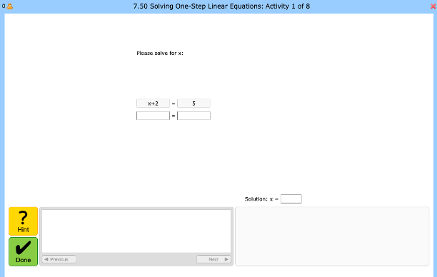

# Intelligent Tutoring Systems {#its}

In 1920s, [Sydney Pressey](https://en.wikipedia.org/wiki/Sidney_L._Pressey), a psycology professor from Ohio State University, developed a mechanical artifact (that is, a **machine**) to provide standardized exercises to students for practicing. Pressey believed that ‘**the procedure in mastery of drill and informational material were in many instances simple and definite enough to permit handling of much routine teaching by mechanical means.**’ Today, Pressey's ‘teaching machine’ can be considered as the first attempt for designing Intelligent Tutoring Systems because not only it allowed students to practice on their own without the support of a teacher, but also because it provided real time feedback: Pressey fixed the machine so that the question remained until the student selected the correct answer.

Pressey's teaching machine encaptulates the premise of Intelligent Tytoring Systems (ITSs): allowing learners to practice on their own while they receive real-time feedback that addresses their individual needs. This premise is reflected in the following definition of ITSs: “[an ITS is] a computer system that aims to provide immediate and customized instruction or feedback to learners.” [@psotka1988intelligent] It is important to note that ITSs do not aim to replace the human tutor but, instead, to support humans in tutoring, enabling and facilitating their pracice.

## A brief history of Intelligent Tutoring Systems

One of -if not- the first intelligent tutoring program, SCHOLAR [@carbonell1970mixed] aimed at engaging learners in learning about georgaphy following a dialogue-based approach. That is, the ITS would ask and answer questions while keeping track of the ongoing dialogue structure. To do so, SCHOLAR was using in the background a semantic network to represent domain knowledge. In this way, the ITS could provide appropriate feedback to the learner, and at the same time, keep track of the knowledge that the learner was acquiring. However, computational limitations in sustaining a natural dialogue and complexity of designing and maintaining the domain knowledge representation made it challenging to develop and deploy such tutoring systems.

Following, coached practice became popular with ITSs like the PAT Algebra Tutor [@anderson1995cognitive]. In such environments, instruction is delivered as learners engage in problem solving tasks. Coached practice embodies the “learning-by-doing” model of cognitive skill acquisition: that is, learners are demonstrated how they should approach and deal with problem-solving and are asked to repeat this practice until they have mastered the skill at hand. As one may expect, problem-solving ITSs focus on STEM domains because of these domain's standardized formalism. Furthermore, a problem solving task constrains the solution and reasoning space for both the learner and tutor, because there is a finite number of acceptable solution. Therefore, the tutor can most of the times interpret the learner's action or - in worst case - offer some advice. This consequently means that coached practice with problem-solving tutors lowers the complexity that dialogue-based tutors face and are, therefore, easier to develop and deploy.

## Cognitive Tutors
A sub-category of problem-solving ITSs are the Cognitive Tutors, that are based on ACT-R theory of skill knowledge [@anderson2013architecture]. This theory assumes a fundamental distinction between declarative knowledge and procedural knowledge (see \@ref(learningtheories)). ACT-R assumes that skill knowledge is encoded initially in declarative form as informed by the learner's experience. Then, through practicing, the learner learns or constructs general rules while solving problems. These rules are encoded as procedural knowledge. For representing procedural knowledge, ACT-R uses production rules. These rules aim to describe the relationship between problem solving goals, learners' actions and states. 

Remember the example we discussed in the class: how does a student learn to solve equations? Then looking at the interface of a math tutor (see Figure \@ref(fig:mathtutor)), try to explain the problem-solving practice of a student and how the ITS captures the declarative and procedural knowledge.

```{r mathtutor, out.width = "13cm", fig.cap="An example interface of a math tutor, taken from the [CMU Math Tutors](https://mathtutor.web.cmu.edu/home)", echo=FALSE, message=FALSE, warning=FALSE}

```

### Model-tracing Tutors
Model-tracing tutors check learners' activity on the *action* level. This means that they keep track of every action a learner makes while solving a problem, like for example ckicking a button. These tutors solve a problem concurrently with the learner and compare the learners' actions to an internal representation of the solution space (possible solutions). To represent the solution space, the model-tracing tutor uses sets of **production rules**. Then, depending on the result of this commparison, if the student action matches a production rule action it is assumed that the student has fired the same cognitive rule and the actions are carried out. If not, the tutor reports that it does not recognize the student’s action.
The complete set of production rules that represent the solution space comprise the cognitive model.


### Example-tracing Tutors
In contrast to model-tracing tutors, the example-tracing tutors try to understand learners' behavior based on specific or typical examples of problem-solving behaviour. That is, instead of matching each action that the learners' can make to the solution space represented by production rules, they try to match the solution path of a learner to potential solutions. To provide real-time feedback, example-tracing tutors use behavior graphs. These graphs represent a finite number of typical  solution paths a learner can follow when solving a problem.

### Knowledge-tracing Tutors
Knowledge-tracing tutors are similar to model-tracing tutors. However, instead of tracing the learners' actions, they are used to calculate the required skills (**knowledge**) students learned. This can be done by employing knowledge graphs or bayesian knowledge models that assess learners' knowledge on specific knowedge components.

## Architecture of Intelligent Tutoring Systems
The fundamental architecture of an ITS consists of four components (see Figure \@ref(fig:itsarchitecture)):

-    The interface component supports student interaction (input/output) with the ITS.
-    The domain model contains the rules, concepts, and knowledge related to the domain that should be learned.
-    The student model keeps track of the students' knowledge: their cognitive and affective states, and their progress as they learn. One may describe the student model as an annotated version of the domain model with information about the student's performance.
-    The pedagogical model uses the data gained from the domain model and student model to make decisions about instructional strategies such as when to give feedback, what kind of learning activity should be provided next to the student and if the student has mastered a skill and is ready to move to the next topic.


```{r itsarchitecture, out.width = "13cm", fig.cap="The architecture of an Intelligent Tutoring System", echo=FALSE, message=FALSE, warning=FALSE}

```
## Effectiveness of Intelligent Tutoring Systems
In 1984, [Bejnamin Bloom](https://en.wikipedia.org/wiki/Benjamin_Bloom) discussed the effectiveness of human tutoring. In his work, Bloom used the term “human tutoring” to refer to an adult, subject-matter expert working synchronously with a single student and suggested that human tutoring was the most effective kind of instruction, with an effect size of d = 2.0 relative to classroom teaching without tutoring [@bloom19842]. In contrast, CAI tends to produce an effect size of d = 0.31 [@kulik1991effectiveness]. 

In 2011, Kurt VanLehn [@vanlehn2011relative] published a wide review of ITS-related studies that demonstrated the following:
1.    human tutoring is not as effective as we once thought;
2.    ITS are almost as effective as adult, one-on-one human tutoring;
3.    None of the studies replaced a classroom teacher with ITS.

Based on the above, Van Lehn concluded that ITSs are indeed as effective as human tutors in the condition where ITSs are used along classroom instruction. Thus, ITSs could be used to replace homework in order to enhance practice outside the classroom, but not as a substitute of the classroom experience.

## Questions for Chapter \@ref(its)
1.    What is an intelligent tutoring system? Definition, principles, and basic architecture.
2.    What is / are the fundamental learning theory or theories behind Intelligent Tutoring Systems? Please elaborate.
3.    What is the basic architecture of Intelligent Tutoring Systems and what are their fundamental components?
4.    There is a saying that human tutoring is the golden standard. What do you think?
5.    What is the difference between model-tracing, example-tracing and knowledge-tracing ITSs? 
6.    What are the behavior graphs that are typically used by example-tracing tutors?

## To-Read
1.    [Corbett, A. T., Koedinger, K. R., & Anderson, J. R. (1997). Intelligent tutoring systems. In Handbook of human-computer interaction (pp. 849-874). North-Holland.](http://act-r.psy.cmu.edu/wordpress/wp-content/uploads/2012/12/173Chapter_37_Intelligent_Tutoring_Systems.pdf)
2.    [Aleven, V., McLaren, B., Sewall, J., & Koedinger, K. R. (2009). Example-tracing tutors: A new paradigm for intelligent tutoring systems.](https://scholar.google.com/scholar?hl=en&as_sdt=0%2C5&scioq=Toward+combining+individual+and+collaborative+learning+within+an+intelligent+tutoring+system.+In%C2%A0Artificial+Intelligence+in+Education&q=Example-Tracing+Tutors%3A+A+New+Paradigm+for+Intelligent+Tutoring+Systems&btnG=#:~:text=include%20citations-,%5BPDF%5D%20cmu.edu,-%5BPDF%5D%20Example)


