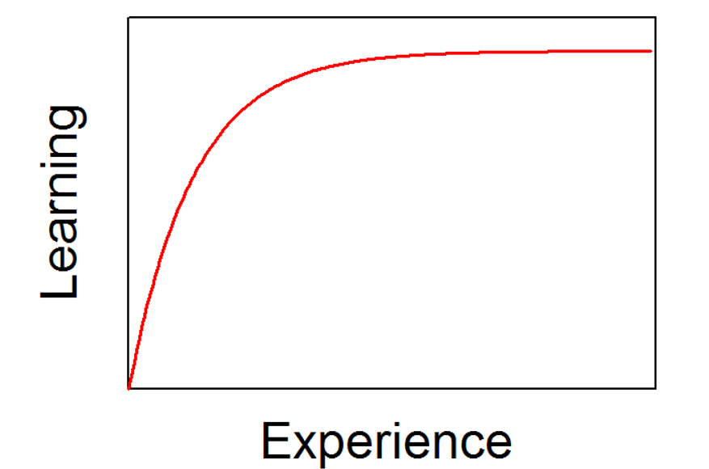
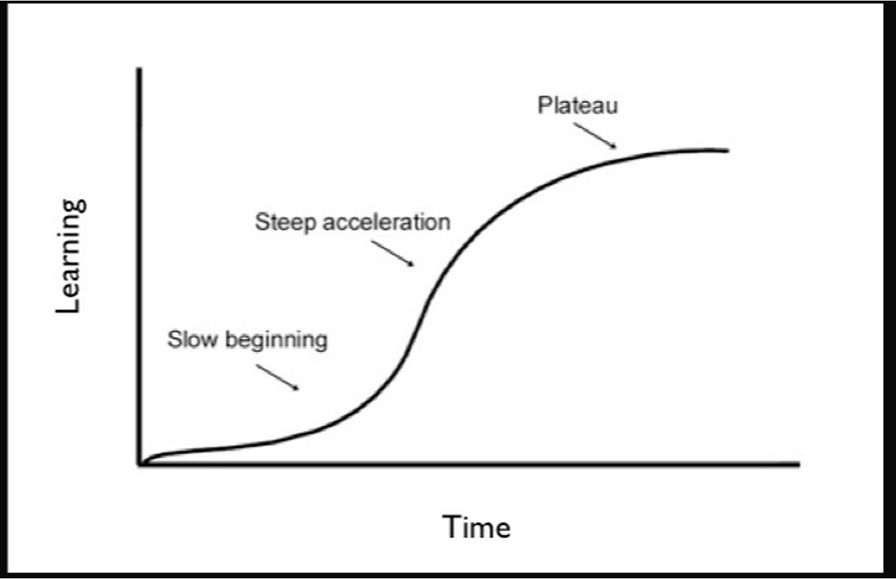
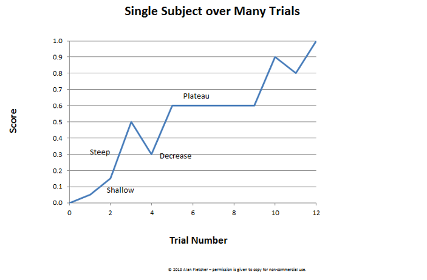
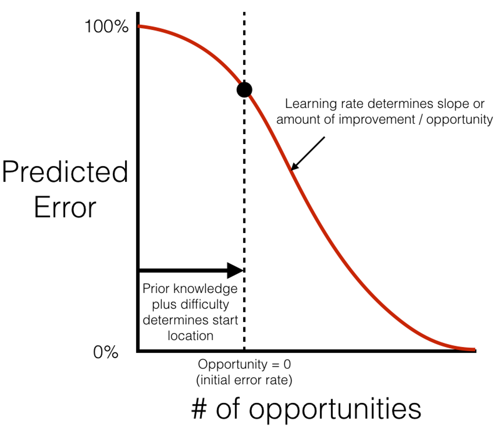

# Student Modeling {#studentmodels}

Going back to the definition of Intelligent Learning Environments (see Chapter \@ref(learningtheories)) and Intelligent Tutoring Systems (see Chapter \@ref(its)), it is evident that in order to provide personalized support tailored to the learners' individual needs, one needs to maintain an accurate and up-to-date representation of individual students. And, one may ask: "*How?*"

When discussing about the architecture of Intelligent Tutoring Systems (Chapter \@ref(its)), we talked about a fundamental compontent: **the student model** and we described it as containing knowledge about the students: their cognitive and affective states, and their progress as they learn. Peter Brusilovsky provided the following definition for student models:

"*A student model is a representation within the architecture of an intelligent learning environment (ILE) of a student's understanding of material being taught*" [@brusilovsky1994student]

## Learning Curve and Predicted Learning Curve
An old saying states that "practice makes better" and another one says that "repetition is the mother of learning". From our own experience, we can attest that learning happens as humans practice over time. This idea is depicted by the concept of the Learning Curve (see Figure \@ref(fig:learningcurve)). Practically, this curve shows that the more a human practices a skill or a piece of knowledge, the more they learn. 

```{r learningcurve, out.width ="10cm", fig.cap="An ideal learning curve that demonstrates the relationship between experience and learning", echo=FALSE, message=FALSE, warning=FALSE}

```

Figure \@ref(fig:learningcurve) shows an ideal curve and Figure \@ref(fig:learningcurvestages) shows different stages of the learning process, as they can be traced on a learning curve. 

```{r learningcurvestages, out.width ="10cm", fig.cap="The different stages of the learning process as depicted on an ideal learning curve that demonstrates the relationship between time and learning", echo=FALSE, message=FALSE, warning=FALSE}

```

In reality, an empirical learning curve (that is, the average correct responses for a skill over each learning opportunity) as calculated by data is not as smooth as the ideal learning curve (see Figure \@ref(fig:empiricallearningcurve). This may happen due to recording errors, but also to the complicated nature of learning (such as forgetting or slipping). 

```{r empiricallearningcurve, out.width="10cm", fig.cap="The different stages of the learning process as depicted on a more realistic learning curve", echo=FALSE, message=FALSE, warning=FALSE}

```

To operationalize mastery learning and learning curves in the context of student models and intelligent tutoring systems, the predicted learning curve is used instead since it is easier to calucate but also much smoother. To compute the predicted learning curve, typically an item-response theory (IRT) model is used (either the Additive Factor Model (AFM) or one of the same family). This model predicts how a student will perform for each skill on each learning opportunity. The predicted learning curve practically shows the average predicted error of a skill (y-axis) over each of the learning opportunities (x-axis) (see Figure \@ref(fig:predictedlearningcurve)). 

Precicted learning curves may reveal the following [@cen2007over]: 
1.    How much practice a student needs to master a skill; Ideally, a predicted learning curve should start high and end high (why?)
2.    What is the optimal set of skills to match the learners' needs; as before, a predicted learning curve should start high and end high (why?)

```{r predictedlearningcurve, out.width="10cm", fig.cap="The predicted learning curve shows a precise prediction of students' success rate at each learning opportunity", echo=FALSE, message=FALSE, warning=FALSE}

```

## Overlay Student Models
Student models that track student's knowledge as subset of the expert/system's knowledge of domain (domain model) are called Overlay Student Models. These models may be *perceived* annotated versions of the knowledge representations used by domain models that asssess learners' knowledge. Overlay student models track some pedagogically relevant measurement as a function of the overlay type (for example, skills, facts, or concepts). Here we will discuss two kinds of overlay models: item-response theory models and model-tracing models [@pavlik2013tutoring].

### Item-Response Theory Models
The Item-Response Theory (IRT) (or else, latent response theory) premise is to calculate the probability of a correct response to an item as a mathematical function of person and item parameters. In practice IRT aims to explain the relationship between latent traits (unobservable characteristics or attributes) and their manifestations (observed outcomes, responses or performance). To do so, one should establish a link between the properties of items on an instrument (this can be a knowledge questionnaire), learners' responding to the items of the questionnaire and the underlying trait being measured (that is, learning). IRT models typically use a structure called Q-matrix to represent the relationship between instrument items' and learners' responses.

Three typical IRT models are the Additive Factors Model (AFM), the Performance Factors Model (PFM) and the Instructional Factors Model (IFM). Briefly:

-    the Additive Factor Models (AFM): Use logistic regression to predict the probability that the student answers a question/item correctly. To make this prediction, the AFM uses the student's prior knowledge, the difficulty of the item, the learning rate of the student (that is, how fast the student learns) and the number of practicing opportunities [@cen2006learning];
-    the Performance Factor Models (PFM): Same as the AFM but it differentiates opportunities based on correct and incorrect responses. That is, the prediction is made depending on student's prior knowledge, difficulty of the item, learning rate of the student and the number of correct and incorrect prior opportunities [@pavlik2009performance];
-    the Instructional Factor Models (IFM): Same as the PFM but this time the model takes into account the "tells". that is, how many times the tutor gave the student the correct answer or additional help [@chi2011instructional].


### Model-tracing Models
Model-tracing models operational principle is to encode the domain model (expert solution) as a set of production rules and compare the student's actions to the domain model. In this way, the tutor tries to understand student actions. If the student's action is the same as the domain model, then everything is great! If the student's action match to some extent then the tutor will follow up with alternative questions to ensure learning. If the student's action does not match with the domain model, then the tutor is not able to understand the error. The tutor will continue asking the question until the student's response matches to the domain model.

One of the most well-know modeling approaches for implementing model-tracing models is Bayesian Knowledge Tracing (BKT). BKT is typically used to track students' progress from one problem to the next relative to production rules practically mapping students' skills either as learned or unlearned. BKT predicts whether a student has learned a skill based on four probabilities [@corbett1994knowledge]: 

-   P(known): the probability that the student already knew a skill.
-   P(will learn): the probability that the student will learn a skill on the next practice opportunity.
-   P(slip): the probability that the student will answer incorrectly despite knowing a skill.
-   P(guess): the probability that the student will answer correctly despite not knowing a skill.

## Questions for Chapter \@ref(studentmodels)

1.    "Student models": Provide a definition, purpose, and examples.
2.    What are the basic modeling parameters for Bayesian Knowledge Tracing (BKT)?
3.    What is Item Reponse Theoty and what are the Item Response Theory (IRT) models?
4.    What is the relationship between student models and the learning curve? 
5.    How is the learning curve operationalized in Intelligent Tutoring Systems? 
6.    A family of common student models is the Item Response Theory (IRT) models and in particular, the AFM, the PFM, and the IFM. Explain what are the similarities and differences between these models, how can they be implemented (regression functions) and relate your response to theories of cognition and learning. Please elaborate on how the models' differences may impact their performance in terms of accuracy and goodness of fit.  

## To-Read
1.    [Pavlik Jr, P. I., Brawner, K., Olney, A., & Mitrovic, A. (2013). Tutoring systems. Des. Recommendations Intell. Tutoring Syst, 1, 39-68.](https://citeseerx.ist.psu.edu/document?repid=rep1&type=pdf&doi=040d21fb726c5175eca9e37801031519f06e0d86#page=63)
2.    [Cen, H., Koedinger, K., & Junker, B. (2006, June). Learning factors analysis–a general method for cognitive model evaluation and improvement. In International conference on intelligent tutoring systems (pp. 164-175). Berlin, Heidelberg: Springer Berlin Heidelberg.](http://pact.cs.cmu.edu/pubs/Cen%2C%20Koedinger%20%26%20Junker06.pdf)
3.    [Pavlik, P. I., Cen, H., & Koedinger, K. R. (2009). Performance factors analysis–a new alternative to knowledge tracing. In Artificial intelligence in education (pp. 531-538). Ios Press.](http://pact.cs.cmu.edu/pubs/AIED%202009%20final%20Pavlik%20Cen%20Keodinger%20corrected.pdf)
4.    [Chi, M., Koedinger, K. R., Gordon, G. J., Jordon, P., & VanLahn, K. (2011). Instructional factors analysis: A cognitive model for multiple instructional interventions.](http://pact.cs.cmu.edu/pubs/Chi,%20Koedinger%20Gordon,%20Jordon%20&%20VanLehn%20-%20edm2011.pdf)
5.    [Corbett, A. T., & Anderson, J. R. (1994). Knowledge tracing: Modeling the acquisition of procedural knowledge. User modeling and user-adapted interaction, 4, 253-278.](http://act-r.psy.cmu.edu/wordpress/wp-content/uploads/2012/12/893CorbettAnderson1995.pdf)
