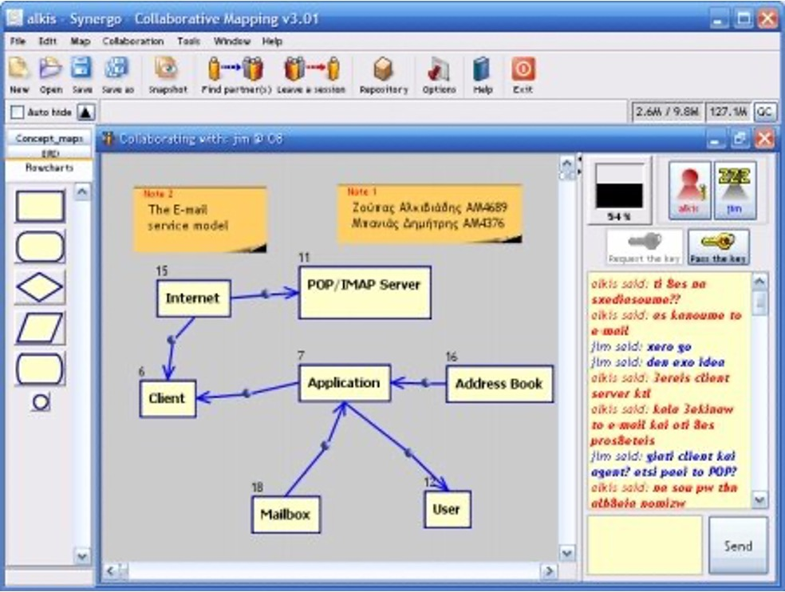

# Collaborative Learning {#cits}

As we saw in earlier chapters, bevaviorism and cognitivism put emphasis on the individual when trying to decode and explain how learning happens. In contrast, social constructivism explores learning in a social environment and perceives the learner and other roles in their environment as a system. 

Collaborative learning builds on the premise of social constructivism. In particular, collaborative learning can be described as "*a situation in which two or more people learn or attempt to learn something together*"[@dillenbourg1999you]. Collaborative learning is considered critical because it allows learners to learn and practice not only knowledge relating to a specific domain (such as physics or mathematics) but also social and soft skills, much needed for navigating within a social context. In particular, research has established that collaborative learning supports practicing communication and critical thinking skills, it is beneficial for learners' confidence and it fosters enjoyement. Also, it promotes diversity and building trust while improving creativity and encouraging commitment.

The practice of using computers as a means to mediate collaborative learning situations is called Computer-Supported Collabroative Learning (CSCL). In other words, CSCL is "*a pedagogical approach wherein learning takes place via social interaction using a computer or through the Internet*"[@stahl2006cambridge]

## Computer-Supported Collaborative Learning Environments
CSCL Learning Environments allow learners to interact with each other and carry out learning activities in collaboration. Such environments typically offer a common workspace where learners can co-create diagrammatic representations like algorithmic flowcharts or concept maps and some additional tool to facilitate communication, for example a chat tool (see Figure \@ref(fig:synergo). 

```{r synergo, out.width = "13cm", fig.cap="Synergo, a CSCL tool to support students who learned introduction to programming", echo=FALSE, message=FALSE, warning=FALSE}

```

Most CSCL environments fall into one of the following three categories [@soller2005mirroring]:

-   Mirroring: these are tools that automatically collect and process data regarding the learners' interaction. Then, they present this information to the learners (usually through visualizations) in order to raise learners' awareness and support self-reflection. 
-   Monitoring: such tools provide information about what the ideal collaboration and interaction should look like and compare this ideal state with the current practice. Monitoring tools aim to support learners but also teachers in diagnosing problems that the learners may encounter.  
-   Guiding: these tools include all functions that mirroring and monitoring tools perform and additionally, they propose remedial actions to help the learners. 

## Collaborative Intelligent Tutoring Systems (CITSs)
Intelligent Tutoring Systems (ITSs) have been criticized for their focus on individual learning and for the lack of support for social aspects of learning. To address this criticism, research has lately explored the use of ITSs for supporting collaborative learning. Such systems, named Collaborative Intelligent Tutoring Systems (CITSs), are
"*learning systems that integrate Artificial intelligence into
collaborative learning environments. CITSs have evolved from
both ITS and CSCL*." [@ubani2022review] Research in CITSs has focused on supporting peer tutoring and adaptive collaborative learning support (ACLS), problem-based learning and scripted collaboration.

### Adaptive Collaborative Learning Support

CITSs that focus on adaptive collaborative learning support (ACLS) adapt their characteristics, and sometimes provide intelligent hints and feedback, to improve students’ collaborative interactions. In such situations, learners typically engage in peer-tutoring scenarios where one learner plays the role of the "student" and the other learner plays the role of the "teacher". The CITS monitors both the activity of the "student" and the "teacher" and provides feedback or guidance either to one or both of them to support their practice. 

An example of such a system is the Adaptive Peer Tutoring Assistant (APTA) [@walker2014adaptive] that aims to support students who learn algebra. Through the CITS, the learner who plays the role of the "teacher" can watch the "student" take problem-solving actions and then, the "teacher" can mark the actions as right or wrong. The learners can communicate using a chat tool and in the same way, they can receive prompts from the CITS, which in turn they can choose to like, dislike or simply ignore.

### CITSs for Problem-based Learning
CITS for Problem-based learning focus on modeling individual knowledge and activity in similar ways like traditional ITSs do (for example,with the use of Bayesian networks) but engaging learners in collaborative activities on shared workspaces.
In such settings, the learners participate in group discussions that are guided by the system. In this way, learners can both use the help of hints provided by the system but also take advantage of discussions with peers.

### CITSs for scripted collaboration
Apart from CITSs that aim to support domain knowledge (such as, math or physics), some systems aim to support soft skills, such as collaboration and communication along with domain knowledge. To do so, these systems build upon established paradigms of ITSs and they add support targeting soft skills.
For example, [@olsen2016investigating] designed a CITS that used a basic ITS for fractions but integrated collaborative scripts to support collaboration. In particular, the collaborative scripts were used by the system in order to distribute tasks and responsibilities to the learners who worked in groups in a structured manner but also in order to provide hints that aimed to help them in collaboration.

## Questions for Chapter \@ref(cits)
1.    What is computer-supported collaborative learning and what is the learning theory that inspired this learning paradigm?
2.    What are Collaborative Intelligent Tutoring Systems (CITS)? Explain how they function and how they support learning using one example.
3.    What is the difference(s) between Intelligent Tutoring Systems and Collaborative Intelligent Tutoring Systems? When would you use an ITS, and when would you use a CITS?

## To-Read
1.    [Pierre, D., & Frank, F. (2007). Basics of Computer-Supported Collaborative Learning. Zeitschrift für Berufs-und Wirtschaftspädagogik,(21), 111-130.](https://www.researchgate.net/publication/37452559_Basics_of_Computer-Supported_Collaborative_Learning)
2.    [Soller, A., Martinez, A., Jermann, P., & Muehlenbrock, M. (2005). From mirroring to guiding: A review of state of the art technology for supporting collaborative learning. International Journal of Artificial Intelligence in Education, 15(4), 261-290.](https://telearn.hal.science/file/index/docid/197378/filename/Soller-Amy-2005.pdf)
