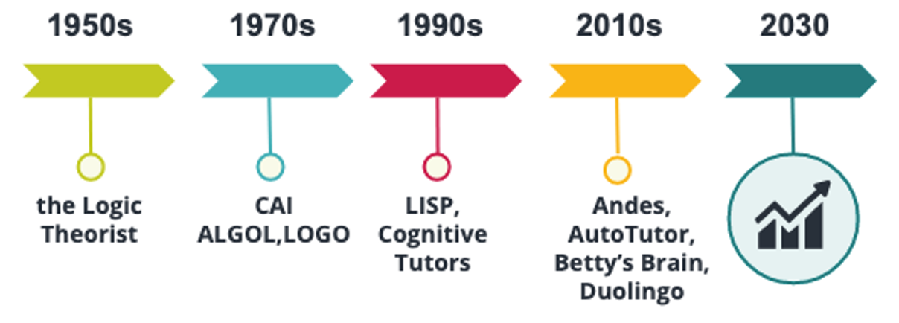
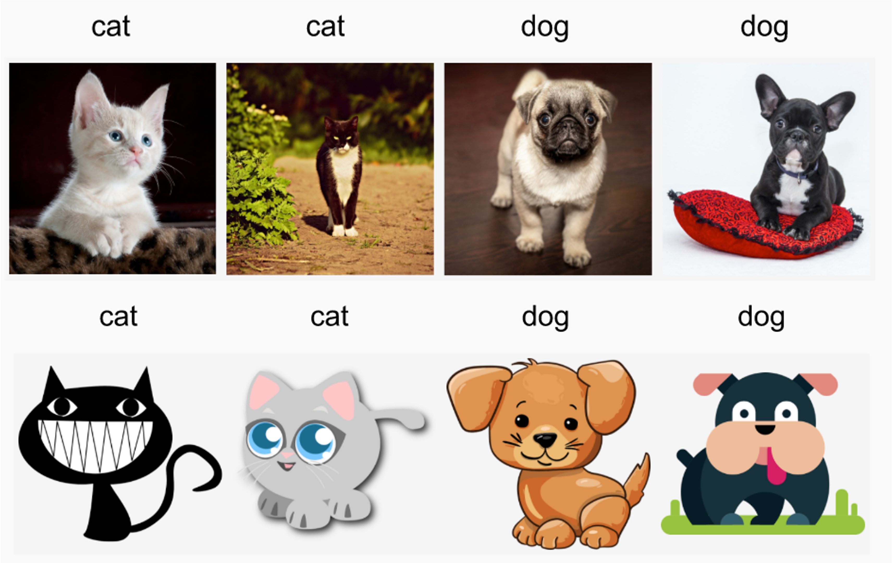

# Artificial Intelligence in Education {#aied}

## What is Intelligence?
"Intelligence" is a complex construct with no clear concise definition. Instead "*there seem to be almost as many definitions of intelligence as there were experts asked to define it.*" [@legg2007collection]. However, going through various definitions from multiple disciplines and domains, make it evident that learning, sense-making and ability to adapt are integral parts of intelligence. Other attempts to define intelligence include the capacity to aquire and apply knowledge, the capacity to solve new problems the ability of a system to act appropriate in uncertain environments. 

## What is Artificial Intelligence?
Similarly to "intelligence", a unique definition of "Artificial Intelligence" (AI) is hard to be widely adopted.
John McCarthy, who has been attributed as coining the term Artificial Intelligence, describes AI as computational technologies that allow machines to act and take decisions imitating human behavior and intelligence: "*It is the science and engineering of making intelligent machines, especially intelligent computer programs. It is related to the similar task of using computers to understand human intelligence, but AI does not have to
confine itself to methods that are biologically observable.*" [@mccarthy2007artificial].

It is important to remember though, that we're talking about machine-based intelligence, where human-defined objectives are turned into predictions, recommedations or decisions. "Intelligent" machines **appear** to work autonomously and can adapt their function as they "learn" from the environment. These important points are demonstrated in the definition provided by [UNICEF](https://www.unicef.org/globalinsight/media/2356/file/UNICEF-Global-Insight-policy-guidance-AI-children-2.0-2021.pdf) that defines AI as: "*AI refers to machine-based systems that can, given a set of human-defined objectives, make predictions, recommendations, or decisions that influence real or virtual environments. AI systems interact with us and act on our environment, either directly or indirectly. Often, they appear to operate autonomously, and can adapt their behaviour by learning about the context.*" 

AI finds application in many fields, including among others government (military), manufacturing, media, law, , health care, internet platforms and **education**.

## Artificial Intelligence in Education (AIED)
Artificial Intelligence in education (AIED) is an academic field of enquiry, officially established in the 1980s, that primarily researches AI tools to support learning (i.e. ‘learning with AI’). It does NOT include aspects of learning about AI or preparing to live with AI (AI Literacy).

### A Bit of History

Although the field itself was established in the 80s, it has roots way earlier (see Figure \@ref(fig:aiedstory). For example, [Herbert Simon](https://en.wikipedia.org/wiki/Herbert_A._Simon) and [Allen Newell](https://en.wikipedia.org/wiki/Allen_Newell) wrote in the '50s a computer program, **the logical theorist** that could prove mathematical theorems and in some cases it produced the same or better results than actual mathematicians :) In the '70s, LOGO - a general purpose programming language - was used to teach students about geometry with the use of visualizations. In the 90's, John Anderson proposed the cognitive architecture ACT-R that set the foundations for modern Cognitive Tutors. 

```{r aiedstory, out.width ="10cm", fig.cap="A timeline of AIED", echo=FALSE, message=FALSE, warning=FALSE}

```

### AIED Premises

AIED is exploring the use of AI as a means to support teaching and learning. As such, it involves the use of AI-driven tools in teaching and learning, and includes:

-   the use of AI to support learners directly (learner-supporting AI) AI involving tools such as Intelligent Tutoring Systems, chatbots, and AI to support learners with disabilities. It does not aim to replace teachers but to act supplementary. 
-   the use of AI to support teachers directly (teacher-supporting AI) with tasks such as automatic assessment, and retrieving or smart curation of learning materials. Main applcation cases involve teacher-facing dashboards that display information about students, recommender systems that propose materials for teachers to be used in the classroom, tools for grading essays or reports and systems that help teachers with drafting lesson plans.
-   the use of AI to support education institutions (institution-supporting AI) with tasks such such as admissions, timetabling, communication and learning management.

## AI Methods in Education

Using AI to learn *about* learners and learning is not strictly AI. However, there is an overlap when it involves the analysis of learning data or learning traces using computational algorithms. This overlapping but nonetheless distinct field is usually known as learning analytics or educational data mining. The methods most commonly used in this field of AIED can be grouped into three categories [@hoppe2017computational]:

-   Content-oriented Methods: These methods aim to analyse learner-generated artifacts (such as reports, concept maps, assignments). Based on the analysis of such articats, we can understand how people learn.
-   Process-oriented Methods: These methods explore the processes that humans apply when learning as manifestated by their activity. For example, the sequence analysis of learners' activity in an LMS platform (e.g. Moodle). 
-   Network-based Methods: These methods aim to explore social aspects of learning, such as how learners explore with other roles, for example teachers or other learners, in the context of learning.

## FATE
Computers, and AI are becoming fundamental parts of our everyday life, and the impact they have on society is considerable. Are algorithms objective, impartial, fair and accurate? Is AI Fair, Accountable, Trasparent and Ethical (FATE)?
We like data and choose things based on data, because they give us a sense of impartiality and subjectivity. We - as humans - do it either when computers are involved or not. However, one thing we cannot ignore, is that algorithms, and algorithms decision-making can be biased. 

Bias can infiltrate in all stages of AI development and deployment including the data (imbalanced / biased data), the models (interpretability, performance), the training and deployment (feedback loops) and evaluation (lack of rigorous analysis, human errors). 

### AI Bias
Two common types of AI-manifested biases are data-driven bias and interpretation-driven bias.
Interpretation-driven bias arises due to our false assumptions and errors about how the models' function or the interpretation of their results.
Data-driven bias arises due to problems in the data that we use to train AI. Three commonly occurring data-driven biases are: selection bias (when the data selection is not randomized), reporting bias (when what we communicate does not reflect the real likelihood, for example news coverage typically focusing on extreme cases) and sampling bias (when specific instances are sampled more frequently, for example sampling more chocolates rather than fruit). Such biases are driven by class or feature imbalances that are hidden in the data. 

#### Bias due to class imbalance

Class imbalance can occur when the real population distribution (see Figure \@ref(fig:classdistribution)) does not match the sample population distribution (see Figure \@ref(fig:classimbalance)) that is used to train the AI algorithm. This is a problem because the prediction always follows training. So if the model is trained on a sample that one class is the majority, then the prediction will favor the majority class. 
```{r classdistribution, out.width= "8cm", fig.cap="The real population distribution of beavers in the wild nature", echo=FALSE, message=FALSE, warning=FALSE}

```

```{r classimbalance, out.width= "8cm", fig.cap="The sample population distribution of beavers used for AI training", echo=FALSE, message=FALSE, warning=FALSE}

```

To solve this problem, one should ensure that either the sample population reflects reality (batch selection) or, if this is not possible, to give more importance to the rare case (weighting).

#### Hidden Bias

Sometimes, there may be hidden features or attributes that affect the balance of the dataset but they are hard to account for, either because they are not explicitly related to the features one want to model or because they are simply not visible and not considered. However, these features can still come into play when training AI algorithms and lead to bias.
In the beavers' example (see Figure \@ref(fig:classdistribution)), such an attribute could be the sex of the beavers that, when left unaccounted could lead to favoring male beavers over female beavers since, depending on the sampling, can end up being the majority class (see Figure \@ref(fig:beavershidden)). 

```{r beavershidden, out.width= "10cm", fig.cap="The sample population distribution of beavers marked with the hidden feature", echo=FALSE, message=FALSE, warning=FALSE}

```


#### Distribution Shift
In some cases, we train our algorithms using curated datasets that does not completely align with the target population. For example, lets assume that we want to train an algorithm to predict whether an image shows a cat or a dog and we train the algorithm with pictures of real cats and dogs. Then we try to apply the algorithm on images that show sketches of cats and dogs instead of real animals (see Figure \@ref(fig:catsanddogs)). This distribution shift (the model being trained on one manifestation of cats and dogs - real animals - and applied on another -sketches ) can lead to overgeneralization bias.


```{r catsanddogs, out.width= "13cm", fig.cap="Two populations of cats and dogs potentially responsible for assuming overgeneralization", echo=FALSE, message=FALSE, warning=FALSE}

```


### Accountability & Transparency in AI:
Transparency regarding AI refers to the quality of being open and explicit about how AI is developed and deployed and why.
Accountability refers to the fact or condition of taking responsible for ones action. Regarding AI, accountability discusses who should be held responsible for decisions that AI systems make.

Transparency and accountability are extremely difficult to address, mainly due to three reasons:

-   Intentional Secrecy: Intentionally not revealing information that is hidden, for example, behind  a business model or for reasons of natianal secuity;
-   Technical Illiteracy: People do not have the background knowledge and expertise to understand the language that AI developers use when communicating information for purposes of transparency and accountability;
-   Complexity of Infrastructure: AI algorithms may be difficult -or even- impossible to reverse engineer or to fully explain how and why the make specific decisions.

However, it is imperative - before deploying AI algorithms - to establish how they were conceived, with what intent, who sanctioned their implementation and who should be held responsible if they fail.


### Ethics and AIED
Ethics can be understood as the moral principles that govern a person, a group of humans or extending to society. Ethical AI refers to the well-defined ethical guidelines regarding human values, such as human rights, non-discrimination, and privacy that AI systems should adhlere to.

Ethics for AIED, in particular, reflect the fundamental principles that AIED systems should respect and integrate by design. Among others, it is critical that AIED systems do not discriminate learners based on their background or characteristics, they respect learners' autonomy and agency, AIED systems should be transparent in terms of how they are implemented and how they make decisions while their decisions should be grounded on pedagogical reasoning, and they should promote societal and environmental well being.

Ethics in AIED is particularly critical today, also because it is not clear how AI can affect cognitive development of humans, especially minors. Therefore many international organizations such as the Council of Europe, UNESCO, and UNICEF have issued calls for evidence that demonstrate the impact of AI in education from the perspective of FATE, but also issue updates regarding ethical design and deployment of AIED. 

## Questions for Chapter \@ref(aied)

1.    Please describe an application area of Artificial Intelligence in Education facing students and one facing teachers.
2.    What are some ethical considerations for designing AI for learning? How could we address them?
3.    What kind of computational methods are typically employed in AIED? Give examples.
4.    They say that algorithms result in "fair" outcomes because they can't be biased, like humans. What is your opinion? Give an example of AI bias and explain how bias arises.

## To-Read
1.    [What is AIED and why does Education need it?](https://www.researchgate.net/publication/241698223_What_is_AIED_and_why_does_Education_need_it)
2.    [The Institute for Ethical AI in Education Interim Report: Towards a Shared Vision of Ethical AI in Education](https://www.buckingham.ac.uk/wp-content/uploads/2020/02/Summary-The-Institute-for-Ethical-AI-in-Educations-Interim-Report-Towards-a-Shared-Vision-of-Ethical-AI-in-Education.pdf)

